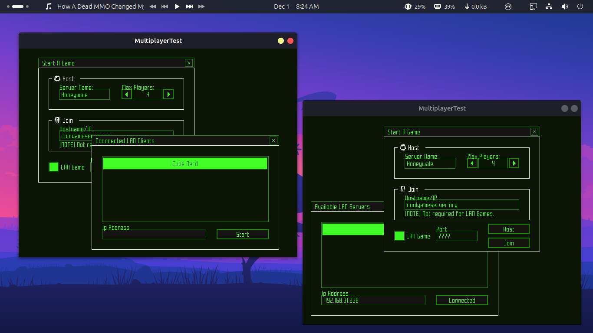

# MultiplayerTest
MultiplayerTest is a simple project I’m working on to understand how multiplayer games really work. It’s built with C++, ENet, and Raylib, and the plan is to develop a single-header library on top of ENet that makes adding multiplayer to games super easy.




### 🎥 Watch The Demo
[](https://www.youtube.com/watch?v=axX8KBae_v0)

## ✨ Features & Goals
- 🧩 Built on Frax Framework (my own Raylib wrapper)
- 🌐 Cross-platform support (PC + Android planned)
- 🔌 LAN & Online multiplayer
- 💬 Basic chat system coming soon
- ⚙️ Uses ENet for fast and reliable networking
- 🧠 Mainly a learning project, but meant to grow into a reusable library

## 🧠 How It Works
- Both the client and server have a Coordinates Struct Players array that stores player positions.
- The server also acts as a player — so you don’t need a dedicated server to play, anyone can just host a session.
- Clients send their position updates to the server.
- The server stores each player’s position in the Players array, adds its own position, and then broadcasts the full array to everyone.
- Everything runs from a single executable — you can choose to start it as a client or server at runtime.
- Provide "host" as an argument to host a session.

## ⚡ How to Run

Clone the repository recursively to make sure the submodules are included:
```sh
git clone --recurse-submodules https://github.com/mastercuber55/MultiplayerTest.git
```
This assumes that you have raylib installed on your system but if you do not. then search online on how to, its pretty simple.

Build the project using CMake:
```sh
mkdir build && cd build
cmake ..
make
```
Run the executable — it can act as either a server or a client depending on the argument you pass:
```sh
./MultiplayerTest host   # runs as server
./MultiplayerTest        # runs as client
```
## 🖥️ Community & Support
Join the Discord server to chat about the project, ask questions, or follow development updates: https://discord.gg/7zvpWnE7QV
